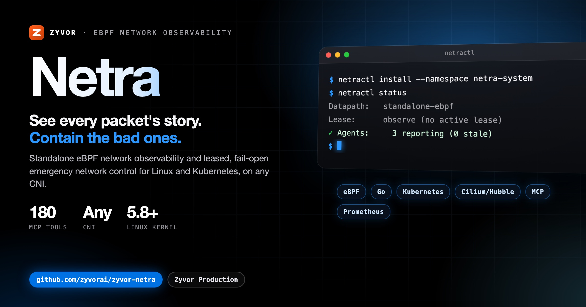
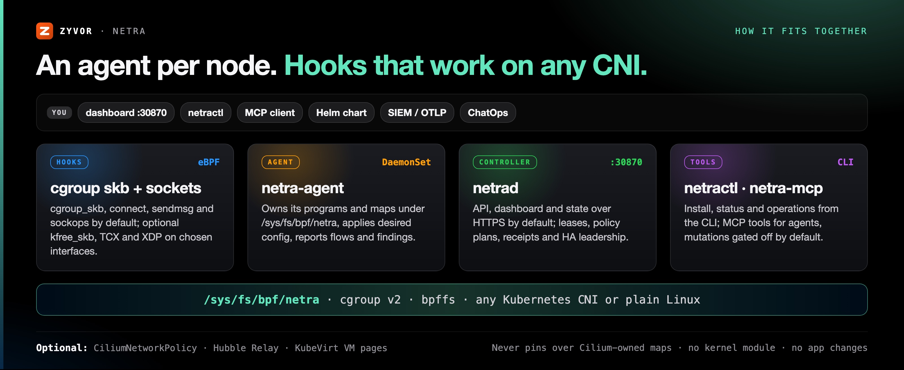
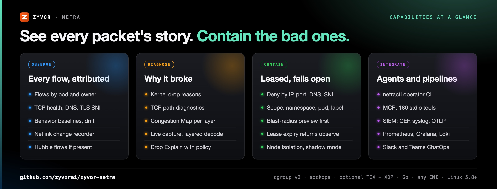

# Netra

[](https://github.com/zyvorai/zyvor-netra/actions/workflows/ci.yml)
[](LICENSE)
[](CHANGELOG.md)

[](https://zyvor.dev/schedule?utm_source=github&utm_medium=netra&utm_campaign=readme_hero)
[](https://zyvor.dev/poc?utm_source=github&utm_medium=netra&utm_campaign=readme_hero)



### See every packet's story. Contain the bad ones. Let go automatically.

**Standalone eBPF network observability and emergency network control for Linux/Kubernetes — with optional Cilium + Hubble enrichment.**

**Observe-first** · **Lease-bounded, fails open** · **No CNI required** · **No payload collection**

📖 **[Read the full docs](https://zyvorai.github.io/zyvor-netra/)** — quickstart, architecture, security model, and a product tour.


## Why Netra

| When this happens… | Netra gives you… |
|---|---|
| Traffic disappears and nobody can say where | Kernel drop attribution: the connection, the reason, and the kernel function that dropped it |
| You need to act now, but enforcement is scary | Leased deny that reverts by itself, previewed against live traffic first |
| Your CNI is not Cilium, or you cannot change it | cgroup v2 hooks that work on any CNI, with no kernel module and no app changes |

Netra does not require Cilium. The node agent owns its own programs and maps below `/sys/fs/bpf/netra`. If Cilium/Hubble exists, Netra can manage `CiliumNetworkPolicy` and display Hubble flows, but both integrations are opt-in.



## See it live

Overview, the Firewall page's unified rules table and NetPol v2 allow-list, then a real in-browser VNC console connected to a running KubeVirt VM — captured against a live lab deployment, not a mockup:




## Observe

Flows with pod and owner attribution, TCP health, DNS, TLS SNI and HTTP Host metadata, behavior baselines and drift. Live Hubble flows when Cilium is present. [Capabilities →](docs/capabilities.md)


## Diagnose

**TCP path diagnostics** measure connect latency and transport pressure per workload, plus edge-observed handshake and RTT histograms that see NAT'd flows. [Path →](docs/path-diagnostics.md) · [Edge intel →](docs/edge-tcp-intel.md)


**Congestion Map** colors every layer of the Linux network stack by its worst finding, cluster-wide. One click jumps to a capture on the offending node. [Kernel diagnostics →](docs/kernel-network-diagnostics.md)


**Packet Capture** streams a filtered, time-bounded capture live, color-coded by protocol, with a Wireshark-style layered decode and hex dump. Opt-in auto-capture persists PCAPs on critical findings. [Capture →](docs/capture.md)


A Congestion Map finding to a live, decoded, color-coded capture on the offending node:


**Drop Explain** answers "why was this dropped?" with kernel reasons and policy context. [Drop diagnostics →](docs/drop-diagnostics.md) · [Drop info →](docs/drop-info.md)


More: [DNS, ICMP, behavior and rate insights](docs/diagnostics-overview.md).

## Contain

Deny by IP, CIDR, port, DNS name, TLS SNI, UID or process, scoped to a namespace, pod, owner or label. Preview the blast radius first. Policy apply stays plan-token + risk confirm. [Firewall page →](docs/firewall.md)


With Cilium enabled, **Pods** and **VMs** get one-click lock down / unlock through the same plan → receipt → apply path:


## Safe by design


| Promise | What it means |
|---|---|
| Observe-first | Rules can be staged while observing. Nothing is dropped until you enforce |
| Leased enforcement | Returns to **observe** when the lease expires, the agent cannot refresh controller state, the controller restarts, or HA leadership changes |
| No payloads | No application payloads, no argv/cmdline, no Secret contents. Opt-in sampled sensors keep counts only |
| Gated automation | MCP mutations stay behind `NETRA_MCP_ALLOW_MUTATIONS`; AI endpoints are read-only |
| Cilium-safe | Never modifies or pins over Cilium-owned BPF maps |

Details: [Architecture and visibility boundaries](docs/architecture.md) · [Safety and persistence](docs/install.md#safety-and-persistence).

## For AI agents and operators

- **`netractl`** — the operator CLI. [Docs →](docs/netractl.md)
- **MCP server** — 180 stdio tools (120 read, 60 opt-in mutating) for AI agents. [Docs →](docs/mcp-integration.md)
- **Built-in AI briefs** — heuristic by default, optional OpenAI-compatible rewrite, read-only. [Docs →](docs/ai.md)
- **Export** — SIEM (CEF, syslog, JSONL, OTLP), Prometheus, Grafana, Loki, Slack and Teams ChatOps.

## Get started in a minute

```bash
make install                              # netractl → /usr/local/bin (or PREFIX=$HOME/.local)
netractl install --namespace netra-system # Helm install: controller + node agent DaemonSet
netractl status
```

Then open `https://<node-ip>:30870` and sign in. The dashboard sits behind a login screen — see [Signing in](docs/dashboard-login.md) (the nav bar and login screen carry the [Zyvor](https://zyvor.dev?utm_source=github&utm_medium=netra&utm_campaign=readme_suite) mark).


Requires Linux with cgroup v2 and bpffs; practical baseline Linux 5.8+ (TCX 6.6+). Run `netra-doctor` first. Full steps, Helm values, Cilium/Hubble and CLI examples: **[Install guide](docs/install.md)**.

## Netra or PacketWolf?

Netra and **PacketWolf** cover the same eBPF territory from opposite directions. They are **counterparts, not a wired pipeline**.

| Choose **Netra** when… | Choose **PacketWolf** when… |
| --- | --- |
| CNI-independent observe + leased emergency kill-switch | Cilium is already the CNI of record |
| Path/Drop/Congestion diagnostics without a full platform | Full AutoPolicy / healer / operator stack |

Rules: [docs/packetwolf.md](docs/packetwolf.md) · [Suite placement](https://zyvorai.github.io/zyvor-netra/docs/core-concepts/packetwolf).

## Documentation map

| I want to… | Read |
|---|---|
| See everything Netra observes and controls | [Capabilities](docs/capabilities.md) · [Feature catalog](docs/p0-p5-surfaces.md) |
| Understand diagnostics | [Diagnostics overview](docs/diagnostics-overview.md) |
| Understand the hooks and architecture | [Architecture](docs/architecture.md) · [Standalone eBPF](docs/standalone-ebpf.md) |
| Install and configure | [Install guide](docs/install.md) · [Helm/manifests](deploy/README.md) · [Host readiness](docs/host-readiness.md) |
| Operate it | [netractl](docs/netractl.md) · [High availability](docs/high-availability.md) |
| Browse the code | [Repository layout](docs/repository-layout.md) · [CI](docs/ci.md) |
| Evaluate it as a buyer | [Buyers guide](docs/sales/buyers-guide.md) · [Brochure and PDFs](docs/sales/) · [Resources](https://zyvorai.github.io/zyvor-netra/resources) |

## License

Commercial subscriptions and support: see [docs/SUBSCRIPTION-MODEL.md](docs/SUBSCRIPTION-MODEL.md).

Licensed under the **[Zyvor Production License v1.0](LICENSE)**.

- **Free** for development, testing, evaluation, research, education, and non-production labs
- **Paid commercial license required** for production, customer workloads, SaaS, managed services, OEM, redistribution, and other revenue-generating use

Commercial terms are issued separately: [https://zyvor.dev](https://zyvor.dev?utm_source=github&utm_medium=netra&utm_campaign=readme_footer).

**Next step:** [Book a demo](https://zyvor.dev/schedule?utm_source=github&utm_medium=netra&utm_campaign=readme_footer) · [30-day PoC](https://zyvor.dev/poc?utm_source=github&utm_medium=netra&utm_campaign=readme_footer) · [sales@zyvor.dev](mailto:sales@zyvor.dev)
