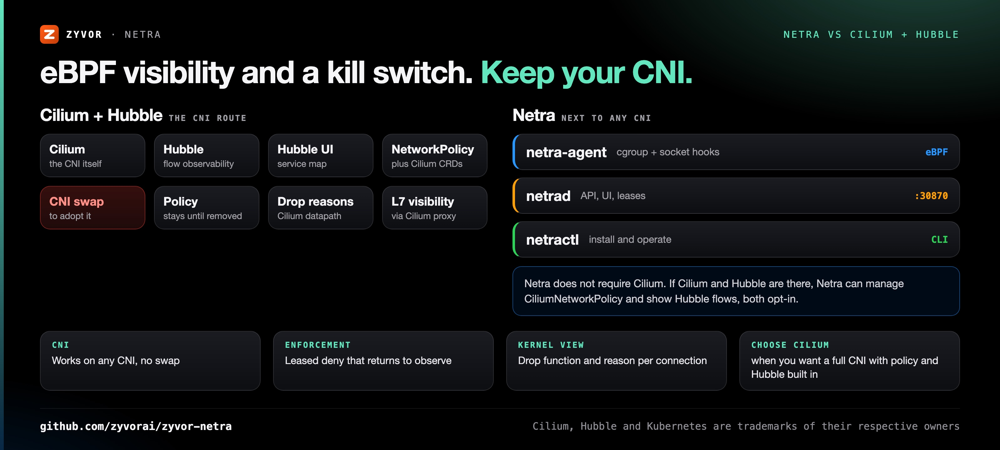

<div align="center">

# Netra

[](https://github.com/zyvorai/zyvor-netra/actions/workflows/ci.yml)
[](LICENSE)
[](CHANGELOG.md)
[](go.mod)
[](bpf)
[](https://zyvorai.github.io/zyvor-netra/)

[](https://zyvor.dev/schedule?utm_source=github&utm_medium=netra&utm_campaign=readme_hero)
[](https://zyvor.dev/poc?utm_source=github&utm_medium=netra&utm_campaign=readme_hero)
[](#quickstart)


### See every packet's story. Contain the bad ones. Let go automatically.

**Standalone eBPF network observability and emergency network control for Linux/Kubernetes — with optional Cilium + Hubble enrichment.** Kernel drop attribution, path and congestion diagnostics, live packet capture, and leased deny rules that return to observe on their own, on any CNI.

**Observe-first** · **Lease-bounded, fails open** · **No CNI required** · **No payload collection** · **183 MCP tools**

📖 **[Read the full docs](https://zyvorai.github.io/zyvor-netra/)** — quickstart, architecture, security model, and a product tour.

</div>

---

## What's new

From [CHANGELOG.md](CHANGELOG.md) (0.28.2 to 0.29.0, and on `main`):

| | |
|---|---|
| **Per-second metrics** *(on `main`)* | Host, network, cgroup, process-group, eBPF and workload RED series every second, with anomaly detection, metric alerts, app collectors, exporters, and a link from any chart spike to the flows and drops behind it. [Docs →](docs/metrics.md) |
| **Node isolation** *(on `main`)* | A per-node allow-only egress filter in **shadow** (count what it would block) or **enforce**, as a standalone TCX program. [Docs →](docs/node-isolation.md) |
| **Netlink change recorder** | Which link, address, route or neighbor changed on a node, and when, across every routing table. [Docs →](docs/netlink-recorder.md) |
| **Netlink findings and alerts** | Default route removed, gateway unreachable, uplink down, MTU changed, derived from the recorded changes. |
| **Who made the change** | An `fentry` on `rtnetlink_rcv_msg` attributes each modifying netlink request to the process that sent it. |
| **BPF attachment inventory** | Netra notices when its own hooks have silently gone, for example after a NIC or bond is recreated. [Docs →](docs/bpf-attachments.md) |
| **One UX contract** | Dashboard and docs site follow one design contract; Apple light by default, dark one click away. |
| **Stable controller certificate** | `tls.existingSecret` serves a `kubernetes.io/tls` Secret so clients can pin the controller certificate. |

---

## Why Netra

| When this happens… | Netra gives you… |
|---|---|
| Traffic disappears and nobody can say where | Kernel drop attribution: the connection, the reason, and the kernel function that dropped it |
| You need to act now, but enforcement is scary | Leased deny that reverts by itself, previewed against live traffic first |
| Your CNI is not Cilium, or you cannot change it | cgroup v2 hooks that work on any CNI, with no kernel module and no app changes |
| "The network is slow" with no evidence | TCP path diagnostics and a Congestion Map that colors every layer of the Linux network stack by its worst finding |
| A chart spiked and you need to know why | Per-second metrics with anomaly detection, where every spike links to the flows, drop reasons and captures from that window |
| You need packets from one node, now | Filtered, time-bounded live capture with a Wireshark-style layered decode, one click from a finding |
| Your AI agent should investigate without breaking things | An MCP server with 183 tools; mutations stay behind `NETRA_MCP_ALLOW_MUTATIONS` |

Netra does not require Cilium. The node agent owns its own programs and maps below `/sys/fs/bpf/netra`. If Cilium/Hubble exists, Netra can manage `CiliumNetworkPolicy` and display Hubble flows, but both integrations are opt-in.


---

## Netra vs Cilium + Hubble



| | **Netra** | **Cilium + Hubble** |
|---|---|---|
| What it is | Observability and emergency control that runs next to your CNI | A CNI with Hubble observability built on its datapath |
| Adoption | Helm install of a controller and a node agent DaemonSet; no CNI change | Cilium becomes the cluster's CNI |
| Kernel hooks | cgroup skb, connect/sendmsg, sockops; optional `kfree_skb`, TCX and XDP | Cilium's own eBPF datapath |
| Enforcement model | Leased deny that returns to observe when the lease expires or the controller loses state | Network policies persist until removed |
| Drop diagnosis | Kernel drop reason and dropping function per connection, plus Drop Explain | Hubble flow verdicts and drop reasons from the Cilium datapath |
| Plain Linux hosts | The same agent and hooks | Built around Cilium-managed networking |
| Works together | Optional `CiliumNetworkPolicy` authoring and Hubble Relay flows | — |
| **Choose Cilium + Hubble when** | | You want a full CNI with policy enforcement and Hubble observability built in, and can make it your CNI |

Netra never modifies or pins over Cilium-owned BPF maps, so the two can share a cluster.

---

## See it live

Overview, the Firewall page's unified rules table and NetPol v2 allow-list, then a real in-browser VNC console connected to a running KubeVirt VM — captured against a live lab deployment, not a mockup:


*The Overview page.* More screens follow in [Observe](#observe), [Diagnose](#diagnose) and [Contain](#contain).

---

## How it fits together


```text
                        Browser / netractl
                               |
                               v
                    +---------------------+
                    |      netrad        |
                    | API + UI + state    |
                    +----------+----------+
                               |
                 desired config| node reports
                               v
       +------------------------------------------------+
       |          netra-agent on every Linux node      |
       |                                                |
       | cgroup skb + socket hooks       optional TCX   |
       |          |                         optional XDP |
       |          +------ Netra maps/ring buffer ------+
       |                 /sys/fs/bpf/netra             |
       +------------------------------------------------+
```

`netrad` serves HTTPS on `:30870` by default. Hook model, visibility boundaries and the optional Cilium/Hubble integration: [docs/architecture.md](docs/architecture.md) · [Standalone eBPF](docs/standalone-ebpf.md).

---

## Quickstart

```bash
make install                              # netractl → /usr/local/bin (or PREFIX=$HOME/.local)
netractl install --namespace netra-system # Helm install: controller + node agent DaemonSet
netractl status
```

Then open `https://<node-ip>:30870` and sign in. The dashboard sits behind a login screen — see [Signing in](docs/dashboard-login.md) (the nav bar and login screen carry the [Zyvor](https://zyvor.dev?utm_source=github&utm_medium=netra&utm_campaign=readme_suite) mark).


Requires Linux with cgroup v2 and bpffs; practical baseline Linux 5.8+ (TCX 6.6+). Run `netra-doctor` first. Full steps, Helm values, Cilium/Hubble and CLI examples: **[Install guide](docs/install.md)**.

---

## Observe

Flows with pod and owner attribution, TCP health, DNS, TLS SNI and HTTP Host metadata, behavior baselines and drift. Live Hubble flows when Cilium is present. [Capabilities →](docs/capabilities.md)


## Diagnose

**TCP path diagnostics** measure connect latency and transport pressure per workload, plus edge-observed handshake and RTT histograms that see NAT'd flows. [Path →](docs/path-diagnostics.md) · [Edge intel →](docs/edge-tcp-intel.md)


**Congestion Map** colors every layer of the Linux network stack by its worst finding, cluster-wide. One click jumps to a capture on the offending node. [Kernel diagnostics →](docs/kernel-network-diagnostics.md)


**Packet Capture** streams a filtered, time-bounded capture live, color-coded by protocol, with a Wireshark-style layered decode and hex dump. Opt-in auto-capture persists PCAPs on critical findings. [Capture →](docs/capture.md)


A Congestion Map finding to a live, decoded, color-coded capture on the offending node:


**Drop Explain** answers "why was this dropped?" with kernel reasons and policy context. [Drop diagnostics →](docs/drop-diagnostics.md) · [Drop info →](docs/drop-info.md)


More: [DNS, ICMP, behavior and rate insights](docs/diagnostics-overview.md).

## Monitor

**Per-second metrics, zero config.** Every node streams host, network stack, conntrack, cgroup, process-group, eBPF datapath and per-workload RED series to the controller, kept at 1 s for an hour, 1 min for two weeks and 1 h for a year. The **Metrics** page charts every context live, with an anomaly ribbon on each chart. [Metrics →](docs/metrics.md)

- **Anomaly detection** on every dimension (unsupervised k-means, stdlib Go), plus "what changed here" ranking for any time range you drag across. [Anomalies →](docs/anomaly-detection.md)
- **Metric alerts** with Netdata-style rules and hysteresis, over 40 built in (CPU, memory, disk, interfaces, TCP, conntrack, workload RED, eBPF drops), sent through your existing Slack, webhook or PagerDuty channels. [Alerts →](docs/metric-alerts.md)
- **Evidence behind every chart**: a spike links straight to the flows, drop reasons, TCP/DNS/HTTP boards and captures from the same window. Metrics and packets in one place.
- **App collectors** for nginx, Apache, HAProxy, Redis, memcached, Envoy, CoreDNS, etcd and any Prometheus endpoint, with optional discovery. [Apps →](docs/app-collectors.md)
- **Export** to Prometheus remote write, OTLP or Graphite, and a read-only fleet roll-up across clusters.

Collectors are read-only, process groups use the kernel comm only (never argv or environment), and alerts never touch enforcement.

## Contain

Deny by IP, CIDR, port, DNS name, TLS SNI, UID or process, scoped to a namespace, pod, owner or label. Preview the blast radius first. Policy apply stays plan-token + risk confirm. [Firewall page →](docs/firewall.md)


With Cilium enabled, **Pods** and **VMs** get one-click lock down / unlock through the same plan → receipt → apply path:


## Safe by design


| Promise | What it means |
|---|---|
| Observe-first | Rules can be staged while observing. Nothing is dropped until you enforce |
| Leased enforcement | Returns to **observe** when the lease expires, the agent cannot refresh controller state, the controller restarts, or HA leadership changes |
| No payloads | No application payloads, no argv/cmdline, no Secret contents. Opt-in sampled sensors keep counts only |
| Gated automation | MCP mutations stay behind `NETRA_MCP_ALLOW_MUTATIONS`; AI endpoints are read-only |
| Cilium-safe | Never modifies or pins over Cilium-owned BPF maps |

Details: [Architecture and visibility boundaries](docs/architecture.md) · [Safety and persistence](docs/install.md#safety-and-persistence).

## For AI agents and operators

- **`netractl`** — the operator CLI. [Docs →](docs/netractl.md)
- **Security review** — DNS QTYPE, versioned threat feeds with TTL/rollback and optional HTTPS refresh, flat deny-predicate suggestions, and exact-workload security correlation. [Docs →](docs/security-review.md)
- **MCP server** — 183 stdio tools (123 read, 60 opt-in mutating) for AI agents. [Docs →](docs/mcp-integration.md)
- **Built-in AI briefs** — heuristic by default, optional OpenAI-compatible rewrite, read-only. [Docs →](docs/ai.md)
- **Export** — SIEM (CEF, syslog, JSONL, OTLP), Prometheus (scrape and remote write), Grafana, Loki, Graphite, Slack and Teams ChatOps.

## Netra or PacketWolf?

Netra and **PacketWolf** cover the same eBPF territory from opposite directions. They are **counterparts, not a wired pipeline**.

| Choose **Netra** when… | Choose **PacketWolf** when… |
| --- | --- |
| CNI-independent observe + leased emergency kill-switch | Cilium is already the CNI of record |
| Path/Drop/Congestion diagnostics without a full platform | Full AutoPolicy / healer / operator stack |

Rules: [docs/packetwolf.md](docs/packetwolf.md) · [Suite placement](https://zyvorai.github.io/zyvor-netra/docs/core-concepts/packetwolf).

## Documentation map

| I want to… | Read |
|---|---|
| See everything Netra observes and controls | [Capabilities](docs/capabilities.md) · [Feature catalog](docs/p0-p5-surfaces.md) |
| Understand diagnostics | [Diagnostics overview](docs/diagnostics-overview.md) |
| Monitor nodes and workloads per second | [Metrics](docs/metrics.md) · [Metric alerts](docs/metric-alerts.md) · [Anomaly detection](docs/anomaly-detection.md) · [App collectors](docs/app-collectors.md) |
| Understand the hooks and architecture | [Architecture](docs/architecture.md) · [Standalone eBPF](docs/standalone-ebpf.md) |
| Install and configure | [Install guide](docs/install.md) · [Helm/manifests](deploy/README.md) · [Host readiness](docs/host-readiness.md) |
| Operate it | [netractl](docs/netractl.md) · [High availability](docs/high-availability.md) |
| Browse the code | [Repository layout](docs/repository-layout.md) · [CI](docs/ci.md) |
| Evaluate it as a buyer | [Buyers guide](docs/sales/buyers-guide.md) · [Brochure and PDFs](docs/sales/) · [Resources](https://zyvorai.github.io/zyvor-netra/resources) |

---

## Maturity

Netra's latest release is **0.29.0** ([CHANGELOG.md](CHANGELOG.md)); node isolation is on `main`, unreleased. What runs by default and what is opt-in ([architecture](docs/architecture.md)):

| Area | Status |
|---|---|
| cgroup skb ingress/egress, connect/sendmsg, sockops hooks | Default |
| `kfree_skb` drop reasons, TCX, XDP | Optional, on selected interfaces |
| Enforcement | Observe by default; leased enforce returns to observe |
| Sampled L7 and TLS plaintext sensors | Opt-in, off by default |
| Cilium `CiliumNetworkPolicy` and Hubble integration | Opt-in (`cilium.enabled`, `hubble.enabled`) |
| MCP mutating tools | Opt-in (`NETRA_MCP_ALLOW_MUTATIONS`) |
| Node isolation | On `main`, shadow or enforce |

---

## Part of the Zyvor stack

| Product | Role next to Netra |
|---|---|
| **Netra** | Standalone eBPF network observability and leased emergency control, on any CNI |
| **[Paqtra](https://github.com/zyvorai/zyvor-paqtra)** | Next to Netra on Cilium clusters: Hubble flow tracing, drop explanations and policy preview |
| **[Rivora](https://github.com/zyvorai/zyvor-rivora)** | Next to Netra: CNI-independent eBPF L4 load balancer with XDP, Maglev and BGP |
| **[Zorvia](https://github.com/zyvorai/zyvor-zorvia)** | Next to Netra: KubeVirt VM platform; with Cilium enabled, Netra's VMs page shows KubeVirt VMs with live flows and lock down |
| **[netevd](https://github.com/zyvorai/zyvor-netevd)** | Next to Netra on hosts: netlink and eBPF network events into hook scripts and policy routing |

→ [zyvor.dev](https://zyvor.dev)

---

## License

Netra is source-available under the **[Zyvor Production License v1.0](LICENSE)** (SPDX `LicenseRef-Zyvor-Production-1.0`, also in [LICENSES/](LICENSES/LicenseRef-Zyvor-Production-1.0.txt)).

- **Free** for evaluation, development, testing, research, education, non-production labs and all other non-production use.
- **Production use** requires an annual enterprise subscription. Plans, support levels and terms: [docs/SUBSCRIPTION-MODEL.md](docs/SUBSCRIPTION-MODEL.md) · [Enterprise pricing](docs/sales/enterprise-pricing.md) · [Pricing](https://zyvor.dev/pricing?utm_source=github&utm_medium=netra&utm_campaign=readme_license) · [sales@zyvor.dev](mailto:sales@zyvor.dev).

Contributions: [CONTRIBUTING.md](CONTRIBUTING.md). Report vulnerabilities privately per [SECURITY.md](SECURITY.md).

---

<div align="center">

### See it, contain it, let go automatically

[](https://zyvor.dev/schedule?utm_source=github&utm_medium=netra&utm_campaign=readme_footer)
[](https://zyvor.dev/poc?utm_source=github&utm_medium=netra&utm_campaign=readme_footer)
[](https://zyvor.dev/pricing?utm_source=github&utm_medium=netra&utm_campaign=readme_footer)
[](mailto:sales@zyvor.dev?subject=Netra)
[](https://github.com/zyvorai/zyvor-netra)

</div>
